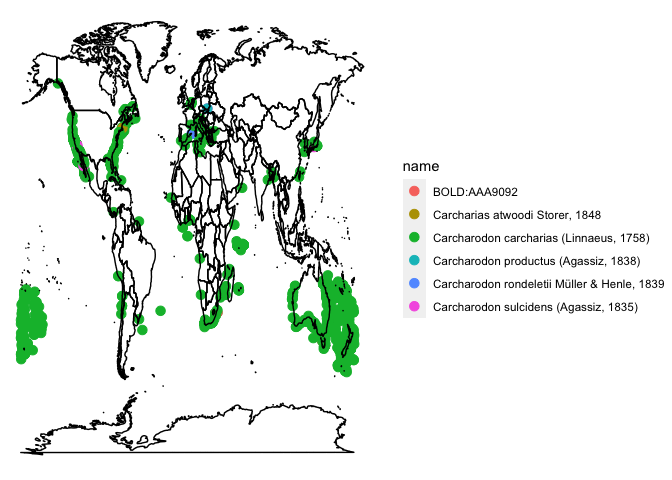

gbifniche
================

R tool for assessing uncertainties around qualities of observation for
environmental niches using GBIF data

## Requirements

-   [R v4.1](https://www.r-project.org/)
-   [rlang](https://CRAN.R-project.org/package=rlang)
-   [dplyr](https://CRAN.R-project.org/package=dplyr)
-   [readr](https://CRAN.R-project.org/package=readr)
-   [ggplot2](https://CRAN.R-project.org/package=ggplot2)
-   [rgbif](https://CRAN.R-project.org/package=rgbif)
-   [rappdirs](https://CRAN.R-project.org/package=rappdirs)
-   [mapr](https://CRAN.R-project.org/package=mapr)

## Installation

    remotes::install_github("kolive4/gbif_thermal_niche")

## Usage

Retrieve a data set by species.

``` r
suppressPackageStartupMessages({
  library(gbifniche)
  library(dplyr)
})

# make it quiet for the purpose of the README markdown
# x = fetch_gbif(species = "Carcharodon carcharias", 
#                verbose = FALSE, progress = FALSE) |>
#   dplyr::glimpse()
```

If you have downloaded multiple datasets you can list the ones you have.

``` r
(spp <- list_gbif())
```

    ## [1] "Carcharodon carcharias" "Menidia menidia"

Now that you have a set of data files you can read them, optionally with
a select number of [GBIF Darwin
Core](https://ipt.gbif.org/manual/en/ipt/2.5/occurrence-data) required
and recommended fields.

``` r
x <- read_gbif(spp[1], dwc = TRUE)
```

    ## Warning: One or more parsing issues, see `problems()` for details

``` r
glimpse(x)
```

    ## Rows: 14,995
    ## Columns: 13
    ## $ occurrenceID         <chr> "https://www.inaturalist.org/observations/1046725…
    ## $ basisOfRecord        <chr> "HUMAN_OBSERVATION", "HUMAN_OBSERVATION", "HUMAN_…
    ## $ scientificName       <chr> "Carcharodon carcharias (Linnaeus, 1758)", "Carch…
    ## $ eventDate            <date> 4496496-10-14, 4495335-05-15, 4495571-12-04, 449…
    ## $ taxonRank            <chr> "SPECIES", "SPECIES", "SPECIES", "SPECIES", "SPEC…
    ## $ kingdom              <chr> "Animalia", "Animalia", "Animalia", "Animalia", "…
    ## $ decimalLatitude      <dbl> 32.88271, -39.15443, -36.59722, -36.09550, -35.12…
    ## $ decimalLongitude     <dbl> -117.2889, 177.2414, 174.8819, 175.5118, 150.4139…
    ## $ geodeticDatum        <chr> "WGS84", "WGS84", "WGS84", "WGS84", "WGS84", "WGS…
    ## $ countryCode          <chr> "US", "NZ", "NZ", "NZ", "AU", "US", "AU", "AU", "…
    ## $ individualCount      <int> NA, NA, NA, NA, NA, NA, NA, NA, NA, NA, NA, NA, N…
    ## $ organismQuantity     <int> NA, NA, NA, NA, NA, NA, NA, NA, NA, NA, NA, NA, N…
    ## $ organismQuantityType <chr> NA, NA, NA, NA, NA, NA, NA, NA, NA, NA, NA, NA, N…

And plot…

``` r
plot_gbif(x, what = 'ggplot')
```

<!-- -->
